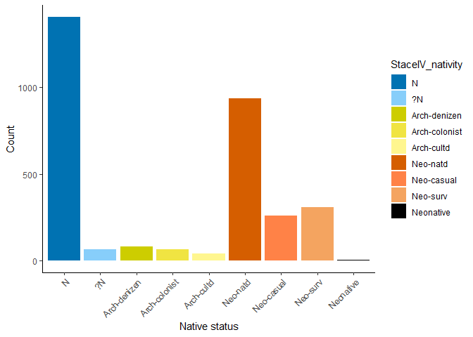

<!-- README.md is generated from README.Rmd. Please edit that file -->

```{r, include = FALSE}
knitr::opts_chunk$set(
  collapse = TRUE,
  comment = "#>",
  fig.path = "man/figures/README-",
  out.width = "100%"
)
```

# BIFloraExplorer

<!-- badges: start -->
[](https://travis-ci.com/mariehenniges/BIFloraExplorer)
<!-- badges: end -->

The goal of BIFloraExplorer is to present an up to date species list for all vascular plants currently extant on the British Isles.


## Installation

You can install the released version of BIFloraExplorer from [CRAN](https://CRAN.R-project.org) with:

``` r
install.packages("BIFloraExplorer")
```

And the development version from [GitHub](https://github.com/) with:

``` r
# install.packages("devtools")
devtools::install_github("mariehenniges/BIFloraExplorer")
```
## Example

The data allows a new insights into current species trends.

```{r example}
library(BIFloraExplorer)

summary(BIlist$StaceIV_nativity)


```

This allows a closer look at how the flora is developing.

```{r , echo = FALSE}
require(dplyr)
BIlist1 = filter(BIlist, StaceIV_nativity != "")

BIlist1$StaceIV_nativity <- factor(BIlist1$StaceIV_nativity, levels = c("N", "?N", "Arch-denizen", "Arch-colonist", "Arch-cultd", "Neo-natd", "Neo-casual", "Neo-surv", "Neonative"))


#plot

require(ggplot2)
ggplot(BIlist1, aes(x=StaceIV_nativity, fill=StaceIV_nativity)) + 
  geom_bar() + theme_classic() +
  theme(axis.text.x = element_text(angle = 45, hjust = 1)) +
  labs(x = "Native status", y = "Count") +
  scale_fill_manual(
    values = c("#0072B2",
               "lightskyblue",
               "yellow3",
               "#F0E442", 
               "khaki1", 
               "#D55E00", 
               "sienna1", 
               "sandybrown", 
               "black"
               ))


```
###Visualisation



