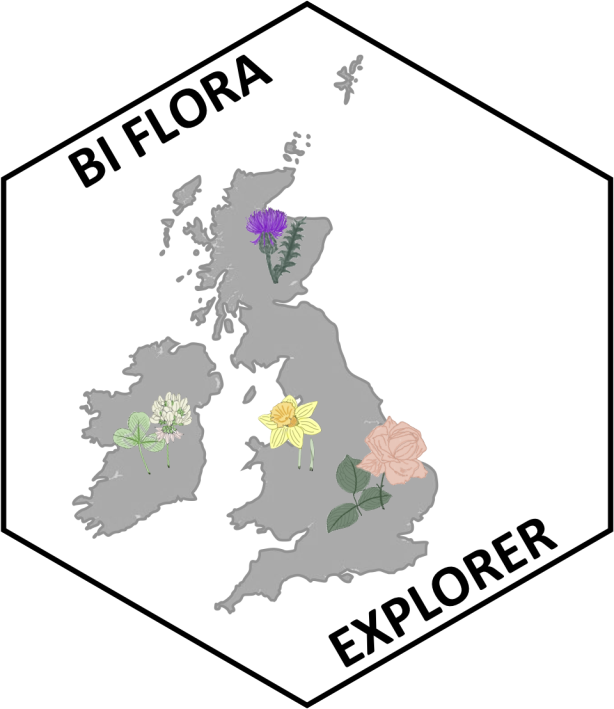

<!-- README.md is generated from README.Rmd. Please edit that file -->

# BIFloraExplorer

<!-- badges: start -->

[](https://travis-ci.com/mariehenniges/BIFloraExplorer)

 <!-- badges: end -->

The goal of BIFloraExplorer is to present an up to date trait repository
and species list for all vascular plants currently extant in the Britain
and Ireland.

## Installation

You can install the released version of BIFloraExplorer from
[CRAN](https://CRAN.R-project.org) with:

``` r
install.packages("BIFloraExplorer")
```

And the development version from [GitHub](https://github.com/) with:

``` r
# install.packages("devtools")
devtools::install_github("mariehenniges/BIFloraExplorer")
```

## Example

The data allows a new insights into current species trends.

``` r
library(BIFloraExplorer)

summary(main$StaceIV_nativity)
```

    ##                          ?N Arch-colonist    Arch-cultd  Arch-denizen 
    ##            50            61            61            40            79 
    ##             N    Neo-casual      Neo-natd      Neo-surv     Neonative 
    ##          1406           260           936           310             4

This allows a closer look at how the flora is developing.


